# Compass CRM 新機能説明資料

**対象者**: 営業担当者  
**作成日**: 2026年3月5日  
**バージョン**: 1.0

---

## 目次

1. [新機能一覧](#新機能一覧)
2. [契約管理機能](#契約管理機能)
3. [外部訪問ログ連携](#外部訪問ログ連携)
4. [マップ機能](#マップ機能)
5. [ヘルプ機能](#ヘルプ機能)
6. [施術所登録から契約までの流れ](#施術所登録から契約までの流れ)

---

## 新機能一覧

今回のアップデートで以下の機能が追加されました。

### ダッシュボード
- 契約済み一覧（直近3ヶ月）
- 契約情報未入力の通知
- 長期（4ヶ月以上）フォロー中
- 訪問履歴自動追加　対象一覧

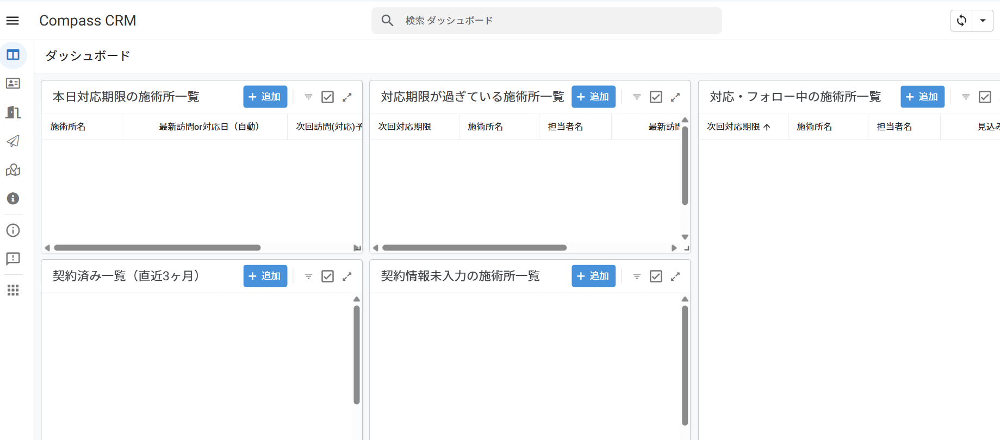

### 訪問ログ一覧
- 訪問ログの一覧表示
- 訪問ログから施術所リストへの追加

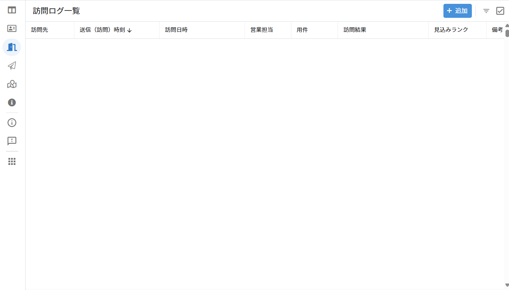

### 訪問先マップ
- 訪問ログの位置情報をもとにマップ表示
- 自分の担当絞り込み可能
- ピンの色で見込みランクを区別

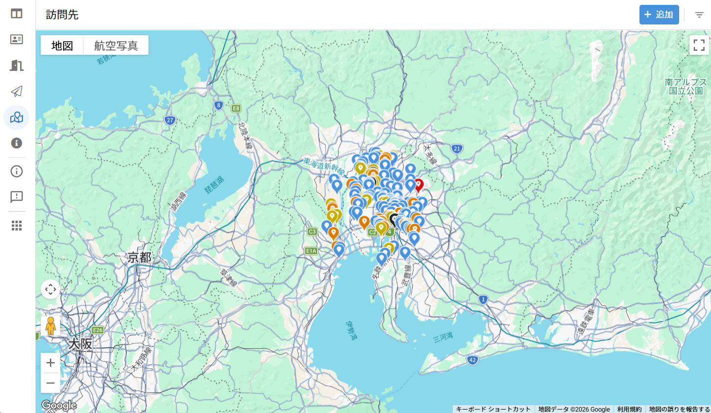

### 施術所詳細画面
- 近隣施術所マップ
- 近隣訪問先ログ
- 契約日表示
- 初回レセ説明日
- 契約情報（契約形態、製品区分、契約年数、月額料金など）

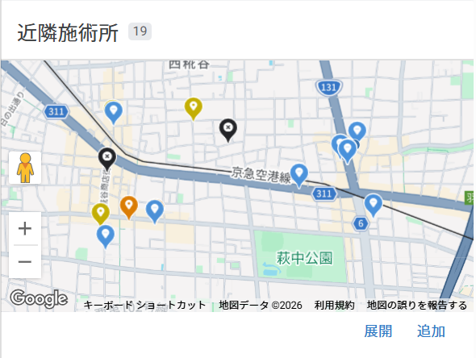

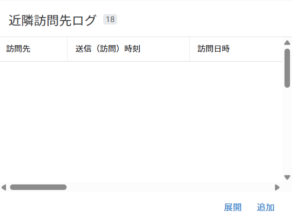

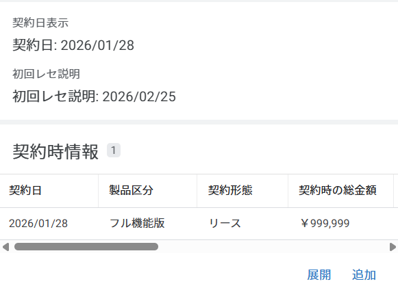

---

## 契約管理機能

契約に関する情報を一元管理できるようになりました。

### 契約情報の入力・編集画面

契約形態によって入力する項目が異なります。

#### 入力項目一覧

| 項目 | 説明 |
|------|------|
| 契約形態 | リース/レンタル/現金から選択 |
| 製品区分 | フル機能版/機能制限版 |
| 契約総金額 | 契約の総額（リース・現金の場合に入力） |
| 月額料金 | 月々の料金（レンタルの場合に入力） |
| 契約年数 | 契約期間（年） |

#### 契約形態別の入力項目

| 契約形態 | 入力項目 | 自動計算項目 |
|---------|---------|-------------|
| **レンタル** | ・月額料金 ・契約年数 | 契約総金額（月額×年数） |
| **リース** | ・契約総金額 ・契約年数 | 月額料金の目安（総額÷年数） |
| **現金** | ・契約総金額 ・契約年数 | 月額料金の目安（総額÷年数） |

**ポイント：**
- 契約形態を選択すると、必要な入力項目が表示されます
- 入力した金額に応じて、自動的に計算されます

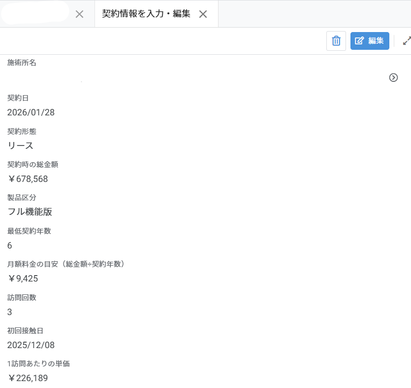

### 契約情報の自動計算

契約形態に応じて、月額料金や総額が自動計算されます。

- **レンタル**：月額料金 × 契約年数 = 総額（自動計算）
- **リース・現金**：契約総金額 ÷ 契約年数 = 月額（自動計算）

### 訪問回数・訪問あたり単価

契約情報入力時に、以下が自動的に計算されます。

- **訪問回数**：契約までの訪問回数（訪問のみカウント）
- **訪問あたり単価**：契約総金額 ÷ 訪問回数

### 初回レセ説明日の⚠️表示

- 契約日から14日経過しても初回レセ説明日が未設定の場合、ダッシュボードに⚠️マークが表示されます。
- 計画・予定の漏れを防ぐために目安として活用してください。

---

## 外部訪問ログ連携

訪問ログアプリで記録した訪問データをCRMに取り込めます。

### 見込み客の登録

訪問ログから新規施設をCRMに登録できます。

**手順：**
1. 左メニューから「見込み客_外部訪問ログ」を開く
2. 登録したい施設を選択
3. 「外部訪問ログから施術所登録」ボタンをタップ

自動的に施設情報と訪問履歴が登録されます。

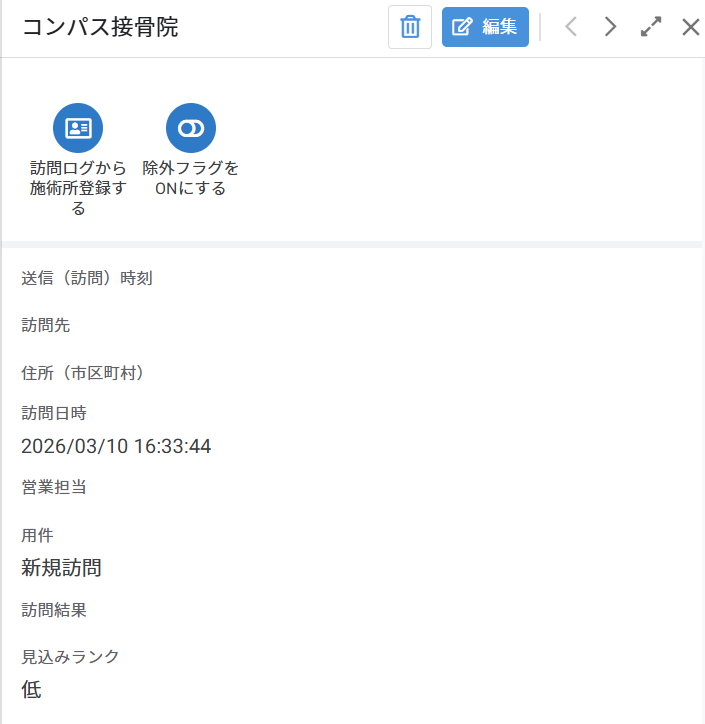

### 訪問履歴の一括追加

既に登録済みの施設への訪問履歴を、訪問ログから一括で追加できます。

**運用：**
- 定期的に川野が一括追加を実施します
- 営業側での操作は不要です

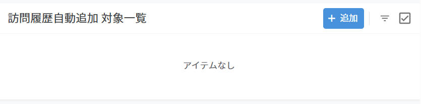

---

## マップ機能

訪問先をマップ上で確認できます。

### ピンの色分け（見込みランク別）

見込みランクに応じてピンの色が変わります。

| 見込みランク | ピンの色 |
|------------|---------|
| 高 | 🔴 赤 |
| 中 | 🟠 オレンジ |
| 低 | 🟡 黄色 |
| 訪問不可 | ⚫ グレー |
| その他 | 🔵 水色 |

優先的に訪問すべき施設が一目で分かります。

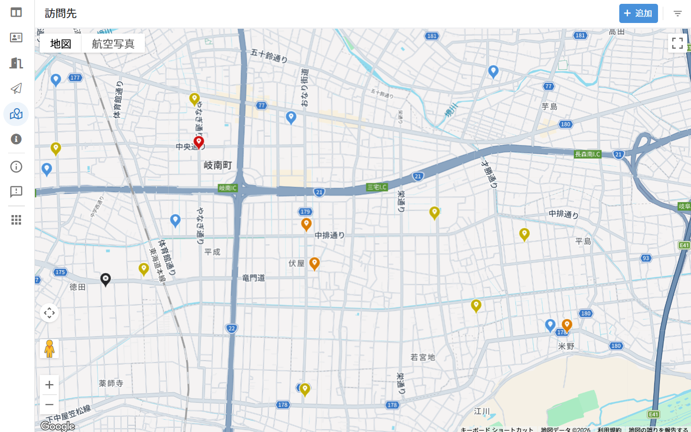

---

## ヘルプ機能

アプリ内で操作方法を確認できます。

### 確認方法

1. 左メニューまたは右上の検索バーから「ヘルプ」を選択
2. カテゴリから項目を選択

### ヘルプのカテゴリ

- 基本操作
- データ管理
- 契約管理
- 外部訪問ログ連携
- ダッシュボード
- 便利機能
- 注意事項
- 困ったとき

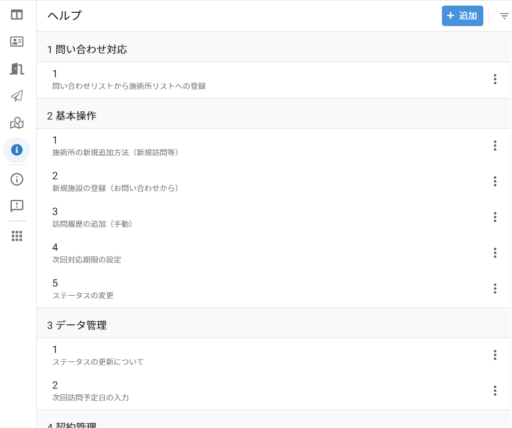

---

## 施術所登録から契約までの流れ

施設を登録してから契約情報を入力するまでの手順を説明します。

### パターンA：お問い合わせから

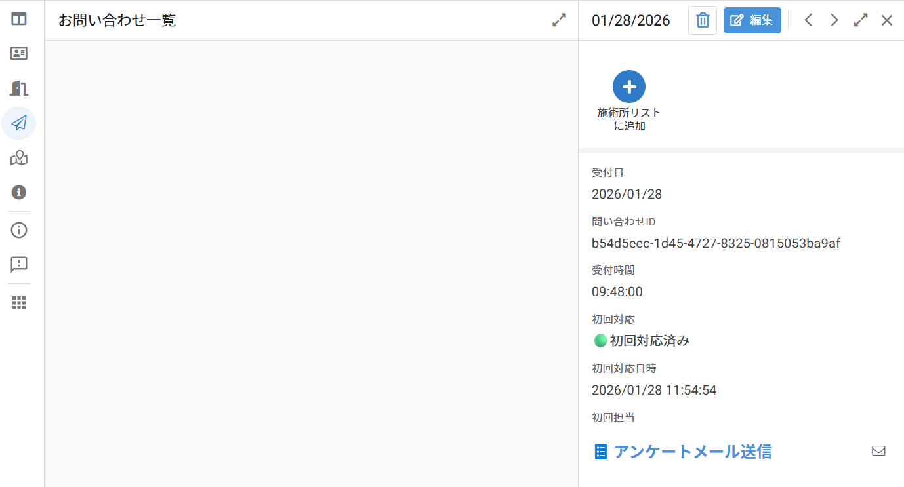

#### 1. お問い合わせ一覧から施術所リストに追加

1. 左メニューから「お問い合わせ一覧」を開く
2. 該当するお問い合わせを選択
3. 「施術所リストに追加」ボタンをタップ
4. 必要項目を入力して保存

#### 2. 訪問履歴を追加

1. 施設詳細画面を開く
2. 訪問履歴セクションの「追加」ボタンをタップ
3. 訪問日、ステータス、温度感、対応内容などを入力
4. 保存

※必要に応じて複数回訪問履歴を追加

#### 3. 契約時の入力

1. 訪問履歴を追加
2. **ステータスを「契約済み」に変更**
3. **契約日を入力**（必須）
4. 保存

#### 4. 初回レセ説明日を入力

1. 施設詳細画面を開く
2. 「初回レセ説明日」欄に日付を入力
3. 保存

#### 5. 契約情報を入力

1. 施設詳細画面に「契約情報を入力」ボタンが表示される
2. ボタンをタップ
3. 契約形態（リース/レンタル/現金）を選択
4. 契約総金額または月額料金、契約年数を入力
5. 保存

→ 訪問回数、訪問あたり単価などが自動計算されます

---

### パターンB：外部訪問ログから

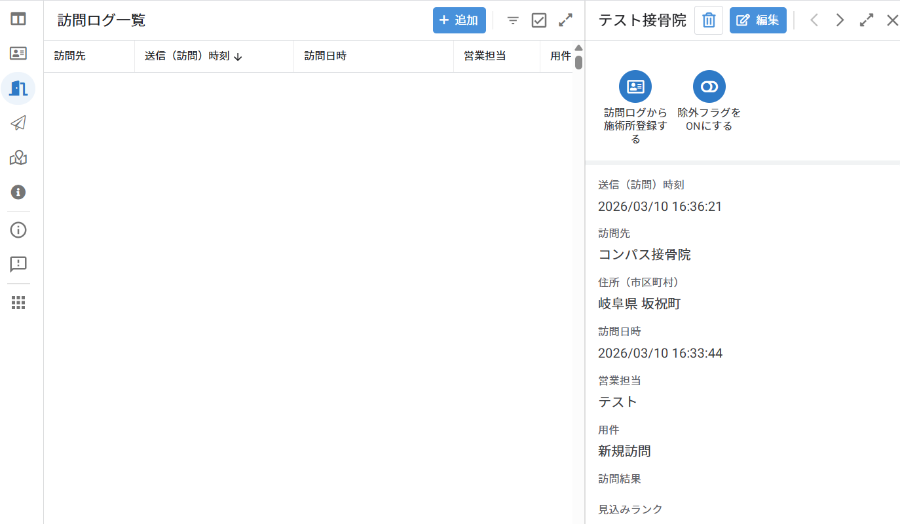

#### 1. 見込み客_外部訪問ログから施術所リストに追加

1. 左メニューから「見込み客_外部訪問ログ」を開く
2. 登録したい施設を選択
3. 「外部訪問ログから施術所登録」ボタンをタップ

→ 自動的に施設情報と訪問履歴が登録されます

#### 2. 以降の手順

**パターンAの「3. 契約時の入力」以降と同じ手順です。**

---

### パターンC：手動追加

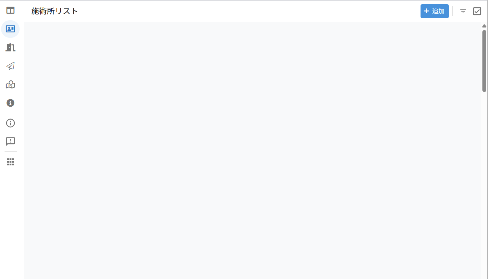

#### 1. 施術所リストに直接追加

1. 左メニューから「施術所リスト」を開く
2. 右上の「+」ボタンをタップ
3. 施設情報を入力して保存

#### 2. 以降の手順

**パターンAの「2. 訪問履歴を追加」以降と同じ手順です。**

---

## まとめ

今回のアップデートにより、以下が可能になりました。

✅ 契約情報の一元管理と自動計算  
✅ 外部訪問ログからの効率的な施設登録  
✅ マップ上での見込みランク確認  
✅ アプリ内ヘルプによる操作サポート

これらの機能を活用して、より効率的な営業活動を行ってください。

---

## 質問・サポート

不明点や困ったことがあれば、以下を確認してください。

1. **アプリ内ヘルプ**：左メニューまたは検索バーから「ヘルプ」
2. **管理者に連絡**：川野まで

---

**以上**
