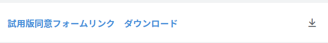
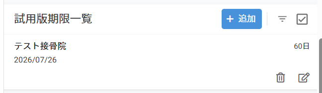
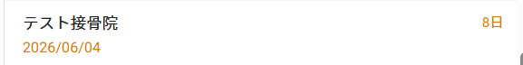
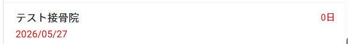
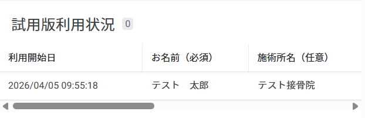
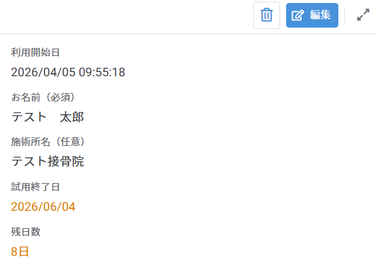
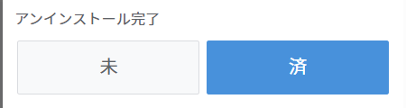
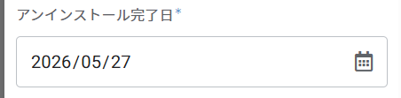
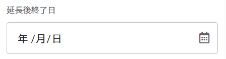

# 試用版管理機能 操作マニュアル

## 概要

試用版ソフトウェアを提供する際の一連の操作手順を説明します。

---

## 1. 試用版フォームURLのダウンロード

試用版を提供する施術所のClinicIDが埋め込まれた同意フォームのURLをテキストファイルとしてダウンロードします。

**手順：**
1. CRMの「施術所リスト」を開く
2. 該当の施術所を選択して詳細画面を開く
3. 「試用版同意フォームリンクダウンロード」ボタンをタップ

4. テキストファイル（`trial_form_〇〇〇〇〇〇.txt`）が自動でダウンロードされる

> 〇〇〇〇〇〇はClinicIDです。

---

## 2. 客先PCへの提供

ダウンロードしたテキストファイルをインストーラーと一緒に、客先PCへ転送または提供します。

- **遠隔操作の場合：** 客先PCへ転送
- **USBメモリの場合：** インストーラーと一緒にUSBメモリに保存し持参

---

## 3. 同意フォームへのアクセス・送信

客先PC上での操作手順です。

**手順：**
1. ダウンロードしたテキストファイルを開く
2. 記載されているURLにアクセス

> ⚠️ **注意：** URLにはCRM上で管理しているClinicIDが自動で埋め込まれています。URLを編集・削除しないようにご注意ください。

3. フォームに必要事項を入力していただく
4. 利用規約に同意して送信

---

## 4. 試用版期限リストの確認

ダッシュボード上で試用版提供中の施術所一覧を確認できます。

**表示場所：** ダッシュボード →「試用版期限一覧」

**色の見方：**

| 色 | 意味 |
|------|------|
| 通常（黒） | 残日数11日以上 |
| 🟠 オレンジ | 残日数10日〜4日前 |
| 🔴 赤 | 残日数3日前〜期限切れ |

> 期限が近づいたら、アンインストールの連絡と作業の準備を行ってください。

---

## 5. アンインストール完了の記録

アンインストール作業完了後、CRM上で記録します。

**手順：**
1. 「施術所リスト」から該当の施術所を開く
2. 詳細画面の「試用版利用状況」を開く

3. 該当レコードを選択→編集ボタンを選択

4. 編集画面を開き「アンインストール完了」を「済」に変更

5. 「アンインストール完了日」を入力　　　　　　　　

---

## 6. 使用期限を延長する場合

試用期間を延長する場合は、CRMから入力します。

**手順：**
1. 「施術所リスト」から該当の施術所を開く
2. 詳細画面の「試用版利用状況」を開く
3. 該当レコードの編集画面を開き「延長後終了日」に新しい終了日を入力して保存

> 延長後終了日が入力されると、CRM上の試用終了日が自動的に更新されます。

---

## 注意事項

- 試用期間は基本的に使用開始から**2か月**です
- 期限終了後はアンインストール作業のために客先に連絡が必要です
- 複数回の延長も可能ですが、「延長後終了日」列は最新の終了日のみ入力してください
